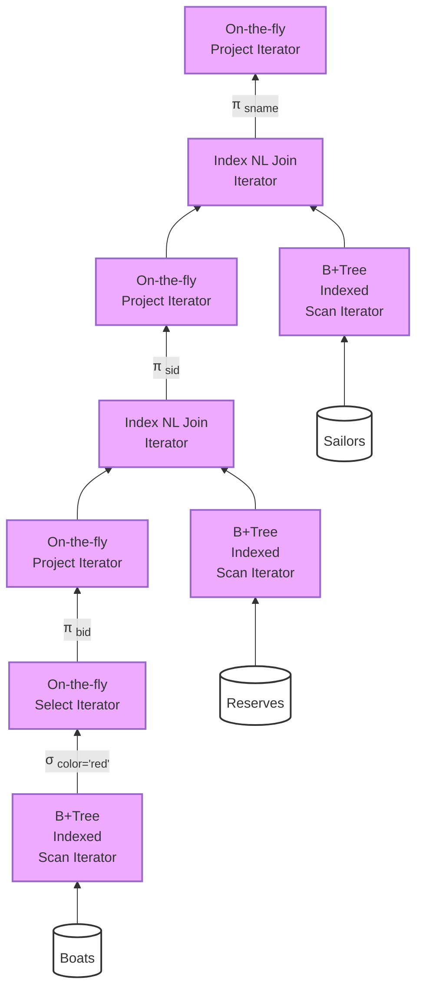

- **Query plan** (a.k.a. dataflow graph)
	- Edges encode "flow" of tuples
	- Vertices = Relational Algebra Operators
	- Source vertices = table access operators ...
- **Query Executor** Instantiates **operators**
	- Each operator instance:
		- Implements **iterator interface**
		- Efficiently executes operator logic forwarding tuples to next operator

#CS/DB/DBMS/query-plan #CS/DB/DBMS/query-plan/operator

#CS/Courses/CS188 
>[[L12. Iterators, Relational Operators and Joins]]