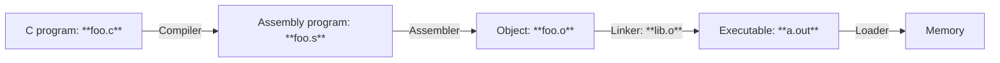

- Q. How to start a program?
	- **CALL**: 
		- Compiler
		- Assembler
		- Linker
		- Loader

### 0. Translater
[[L9.0 Translation and Interpretation]]
### 1. Compiler
[[L9.1 Compiler]]
### 2. Assembler
[[L9.2 Assembler]]
### 3. Linker
[[L9.3 Linker]]
### 4. Loader
[[L9.4 Loader]]
### 5. Example
[[L9.5 example]]
### Summary
- Compiler converts a single HLL file into a single assembly file `.c` -> `.s`
- Assembler removes pseudo-instructions, converts what it can to machine language, and creates a checklist for linker (relocation table) `.s` -> `.o`
	- Resolves addresses by making 2 passes (for internal forward references)
- Linker combines several object files and resolves absolute addresses `.o` -> `.out`
	- Enable separate compilation and use of libraries
- Loader loads executable into memory and begins execution

#CS/RICS-V/CALL 

#CS/Courses/CS61c 
>[[UCB CS61C]]