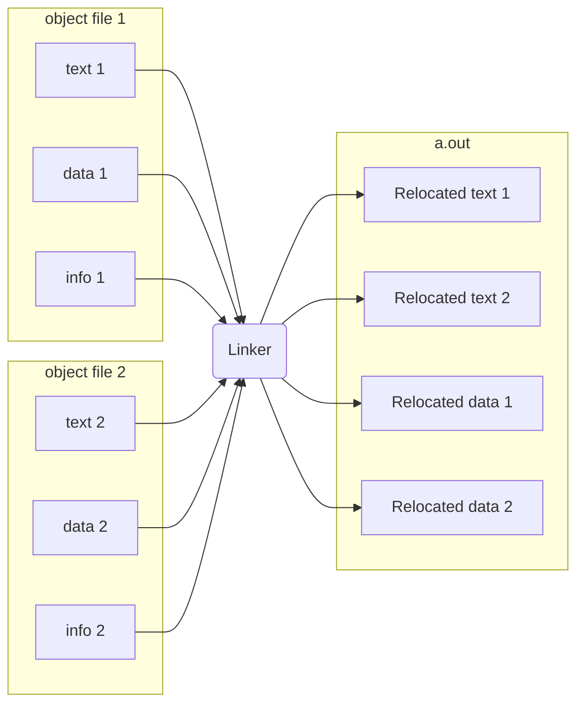

- Overview
	- Input: Object Code files, information tables (e.g. `foo.o`, `lib.o` for RISC-V)
	- Output: Executable Code (e.g. `a.out` for RISC-V)
	- Combines several object (`.o`) files into a single executable ("linking")
	- Enables separate compilation of files
		- Changes to one file do not require recompilation of whole program
		- Old name "Link Editor" from editing the "links" in jump and link instructions

- Procedure
	1) Take text segment from each `.o` file and put them together
	2) Take data segment from each `.o` file, put them together, and concatenate this onto end of text segments
	3) Resolve References
		- Go through Relocation Table; handle each entry
		- i.e. fill in all absolute addresses
- Three Types of Addresses
	- PC-Relative Addressing (`beq`, `bne`, `jal`)
		- never relocate
	- External Function Reference (usually `jal`)
		- always relocate
	- Static Data Reference (often `auipc` and `addi`)
		- always relocate
		- RISC-V often uses auipc rather than lui so that a big block of stuff can be further relocated as long as it is fixed relative to the pc
- Absolute Addresses in RISC-V
	- Q. Which instructions need relocation editing?
		- J-format: jump/jump and link
		- Loads and stores to variables in static area, relative to global pointer
	- Q. What about conditional branches
		- PC-relative addressing preserved even if code movs.
- Resolving References
	- Linker assumes the first word of the first text segment is at Ox10000 for RV32.
		- More later when we study "virtual memory"
	- Linker knows:
		- Length of each text and data segment
		- Ordering of text and data segments
	- Linker calculates:
		- Absolute address of each label to be jumped to (internal or external) and each piece of data being referenced
	- To resolve references:
		1) Search for reference (data or label) in all "user" symbol tables
		2) If not found, search library files (e.g. printf)
		3) Once absolute address is determined, fill in the machine code appropriately
	- Output of linker: executable file containing text and data (plus header)

#CS/RICS-V/CALL/linker

#CS/Courses/CS61c 
>[[L9. CALL]]